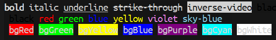

[](https://travis-ci.com/jcs-elpa/chalk)
[](https://www.gnu.org/licenses/gpl-3.0)

# chalk
> Log message cleanly with color on it.

## Usage

### Code

```el
(chalk-log-red "This is red")
(chalk-log-green "This is green")
(chalk-log-blue "This is blue")
(chalk-log-purple "This is purple")

(chalk-log-bold "This is bold")
(chalk-log-italic "This is italic")

(chalk-log-underline "This with underline")
(chalk-log-overline "This with overline")
(chalk-log-strike-through "This with strike-through")

(chalk-log-inverse-video "This with inverse-video")

(chalk-log (chalk-inherit "This with inherit" :inherit 'font-lock-comment-face))
```

### Output



## Contribution

If you would like to contribute to this project, you may either
clone and make pull requests to this repository. Or you can
clone the project and establish your own branch of this tool.
Any methods are welcome!
