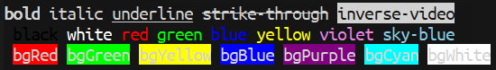

[](https://travis-ci.com/jcs-elpa/chalk)
[](https://www.gnu.org/licenses/gpl-3.0)

# chalk
> Customize text easily with log.

<p align="center">
  
</p>

This package brings propertize string a bit easier for common usage.

## Usage

You can propertize string easily by supported API.

```el
(chalk-red "This is red")  ; Make string color red
```

Hence you can work with nested like this below.

```el
(message "%s %s" (chalk-red "red") (chalk-blue "blue"))
```

## Contribution

If you would like to contribute to this project, you may either
clone and make pull requests to this repository. Or you can
clone the project and establish your own branch of this tool.
Any methods are welcome!
